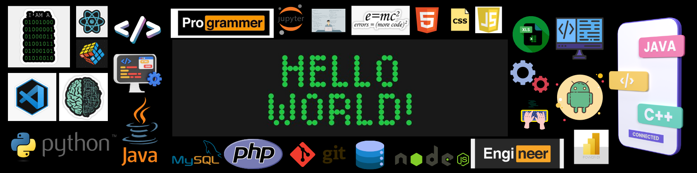
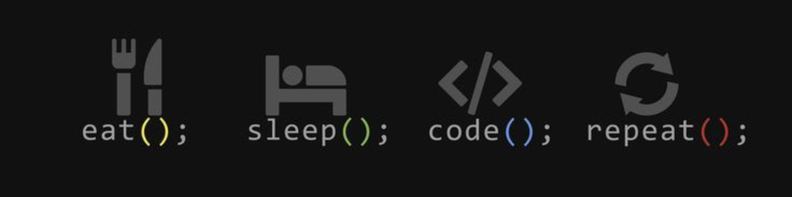

# 💫 About Me:
## **👋 Hi, I'm Arunagirinathan**   
**AI + Data Science Student | Research Contributor |Startup-Focused Innovator**  
**AI & Full-Stack Developer | Turning Ideas into Intelligent Systems**  
**Passionate about Data Science, Cybersecurity, and Quantum AI**  
**Engineering the Future with AI, Cloud & Code**  
**"AI x Cloud x Security | Building the Future, One Model at a Time"**

## 🌐 Socials:
 

## Experience 🧑🏻‍💻
<!--  -->

<!--  -->
<!--  -->
<!--  -->
  

## 🏙 My GitHub Skyline

# <h2 align="left">  Github Statistics</h2>

  
  
  
  
  

  
  
  
  
  

  

## 🏆 GitHub Trophies

### 🔝 Top Contributed Repo

---

<!-- Proudly created with GPRM ( https://gprm.itsvg.in ) -->
