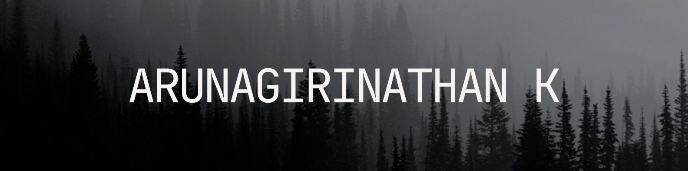

## *AI Assisted SAAS builder | FullStack Developer | Full Time Oper Sourcerer*

*AI & Full-Stack Developer building intelligent systems and real-world ML applications.Experienced across full AI pipeline from data analysis and model training to scalable deployment.Working across data pipelines, ML models, and production-ready AI solutions. Proficient in   *

 
<!-- *I am an AI & Full-Stack Developer working on AIML projects, Data Science applications, and realtime problems. I aim to be a Data Scientist and AI Engineer with proficiency in Python and Java, knowledge of ML and DL, and expertise in TensorFlow and PyTorch. I build and deploy ML/DL solutions. I’m proficient in data analysis (Pandas, NumPy, SQL, PowerBI), data handling, and model training (scikit-learn, Keras).* --->

    
    
    
    
  

  

    
    
    
  

  
---

## Tech Stack

 

---

  
## Here’s my GitHub Score, updated daily:

<!--SCORE_START-->
🏆 **GitHub Score:** 3209

📊 Formula: (Commits ×0.5 + Stars ×5 + Forks ×3 + PRs ×4 + Issues ×2 + Followers ×2)

🎮 **Level 6**
[▓▓▓▓░░░░░░] 41%
<!--SCORE_END-->

---

# <h2 align="center"> Github Statistics</h2>

<!-- Row 1: 3 equal columns -->

<!-- Row 2: 2 equal columns (no table borders, freely aligned) -->

<!-- Row 3: Profile Details (left) + Activity Graph (right) -->

---

## 🤝 Connect With Me
  
*I'm always open to collaborating on interesting projects, discussing AI/ML innovations, I Contribute to community projects, fixing bugs, improving docs, and building reusable components for data and AI tooling.*

---
