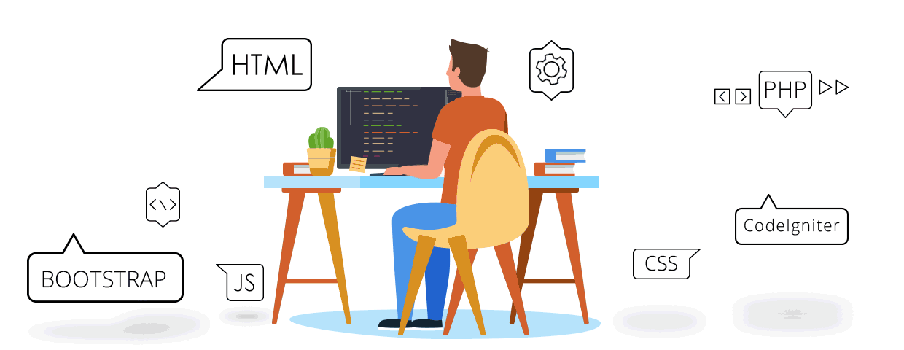

# Hi 👋, I'm ARUNAGIRINATHAN-K

*A passionate AI Full Stack developer from India*

  

 

My work focuses on **Agentic AI, Machine Learning, and Full Stack Development**, with a strong interest in **open-source collaboration, community projects, fixing bugs, improving docs**. Experienced across full AI pipeline from data analysis and model training to scalable deployment. Working on data pipelines, ML models, and production ready AI application.

* Website: [arunagirinathank.dev](https://arunagirinathank.dev)
* GitHub: [@ARUNAGIRINATHAN-K](https://github.com/ARUNAGIRINATHAN-K)
* LinkedIn: [in/arunagirinathan-k](https://linkedin.com/in/arunagirinathan-k)
* Kaggle:  [arunsworkspace](https://www.kaggle.com/arunsworkspace)
* Hugging Face: [ARUNAGIRINATHAN](https://huggingface.co/ARUNAGIRINATHAN)

 

  
GitHub Stat

  

<table width="100%" cellspacing="0" cellpadding="0" border="0" style="border-collapse:collapse;border:none;">
  <tr>
    <td width="50%" align="center" valign="middle" style="border:none;">
      
    </td>
    <td width="50%" align="center" valign="middle" style="border:none;">
      
    </td>
  </tr>
  <tr>
    <td colspan="2" align="center" valign="middle" style="border:none;padding:0;">
      
    </td>
  </tr>
</table>

## Blogs Post

- [AI Registry Platform](https://ai-agent-registry-kappa.vercel.app/)
- [AI Agentic Systems & Orchestration: The Architecture Behind Intelligent Automation](https://medium.com/@arun31.march.2k6/ai-agentic-systems-orchestration-the-architecture-behind-intelligent-automation-8fd3ab739b30)
- [Building a Production-Grade RAG Pipeline for 10 Million Documents with Minimal Hallucinations](https://medium.com/@arun31.march.2k6/building-a-production-grade-rag-pipeline-for-10-million-documents-with-minimal-hallucinations-4a808384fddf)

## My Open-Source Projects

- [AI Registry Platform](https://ai-agent-registry-kappa.vercel.app/) - 500+ AI agents, tools, frameworks, protocols, MCP servers, and infrastructure for developers.
- [Awesome AI Agents](https://github.com/ARUNAGIRINATHAN-K/awesome-ai-agents-2026) - A curated collection of AI agent frameworks, tools, and resources.
- [Awesome LLMOpsSec](https://github.com/ARUNAGIRINATHAN-K/awesome-llmsecops) - Curated LLM and GenAI security tools, research, frameworks, and practices.
- [NeuroMath](https://github.com/ARUNAGIRINATHAN-K/NeuroMath) - Mathematical Core of Artificial Neural Networks.
- [Text Classification](https://github.com/ARUNAGIRINATHAN-K/Text-Classifier-using-NLP_Techniques) - A Text Classification using NLP Techniques.
- [Data Science Portfolio](https://github.com/ARUNAGIRINATHAN-K/Data-Science-Portfolio) - Collection of simple insightful Data Science projects.

## 🤝 Connect With Me
  
*I'm always open to collaborating on interesting projects, discussing AI/ML innovations, I Contribute   to community projects, fixing bugs, improving docs, and building reusable components for data and AI tooling.*

