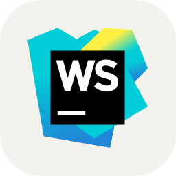
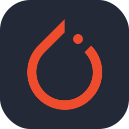

  
&nbsp;
# Hi, I'm ARUNAGIRINATHAN

&nbsp;
  
&nbsp;
  
  
  

# ✨ TRUST ME I'M AN ENGINEER

*I am a AI & Full-Stack Developer working on AI & ML projects, Data Science applications, and realtime problems,aspiring to become a Data Scientist and AI Engineer having proficiency in programming languages like Python, knowledge of machine learning algorithms and deep learning, and expertise in AI frameworks such as TensorFlow and PyTorch. Building and deploying Machine Learning and Deep Learning solutions.Proficient in data analysis (Pandas, NumPy, SQL),data handling,model training (Scikit-learn, Keras) and problem-solving.*

## Experience 🧑🏻‍💻
 
  
  

 
  
  
  
  
  
 
  
 

 

  
  
 

  

  

  
  
  

  

  
  
  
  
  
  
  
  
  

<!------>

## Here’s my GitHub Score, updated daily:

<!--SCORE_START-->
🏆 **GitHub Score:** 1203

📊 Formula: (Commits ×0.5 + Stars ×5 + Forks ×3 + PRs ×4 + Issues ×2 + Followers ×2)

🎮 **Level 2**
[▓▓▓▓░░░░░░] 40%
<!--SCORE_END-->
 

## Kaggle Achievements  

  
  
  
  

 

## ✍️ Articles & Blogs  

  

  

  

# <h2 align="center">  Github Statistics</h2>

 

  
  
  
  
  

  

---

<!-- Proudly created with GPRM ( https://gprm.itsvg.in ) -->
